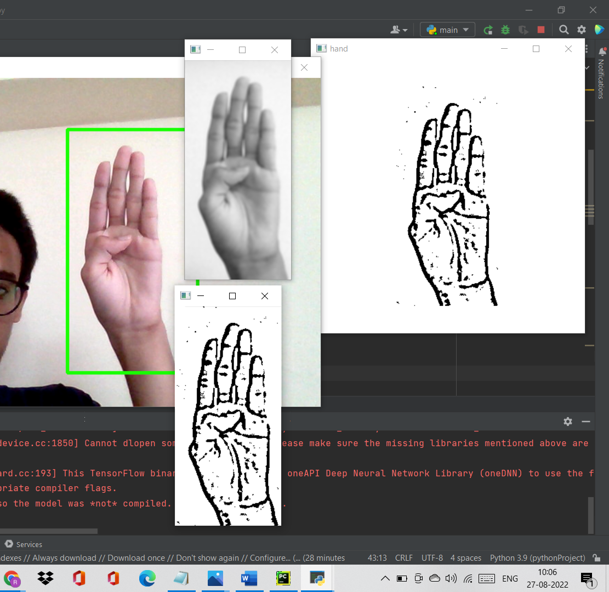
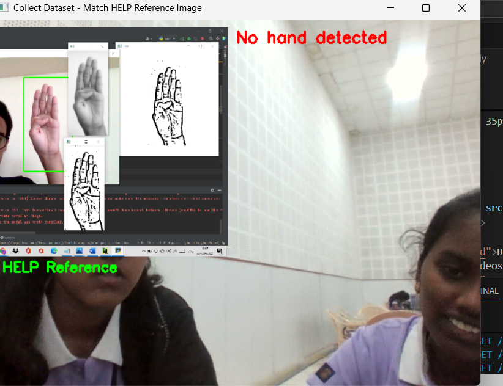

# SignBridge

## System Architecture

## Workflow

## AI-Powered Sign Language Learning & Communication Platform

SignBridge is an AI-powered web platform that helps deaf and hard-of-hearing learners communicate and learn sign language through interactive videos and speech-to-sign conversion.
